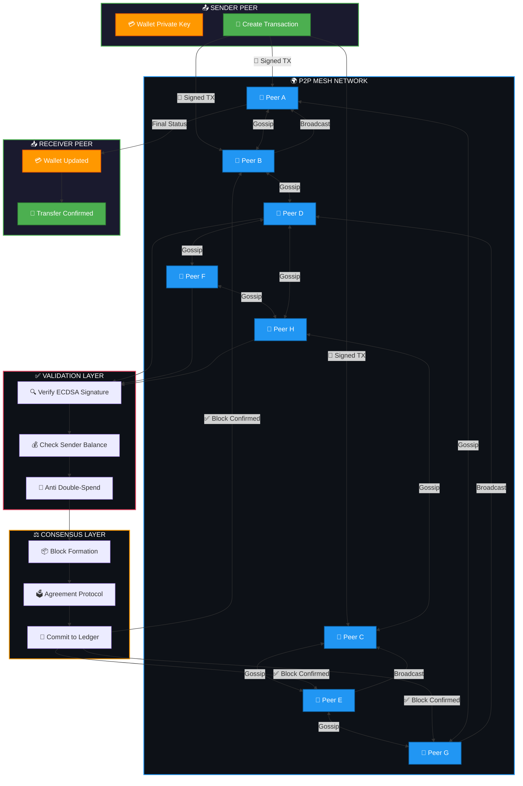

# 🔄 P2P Transaction System

## 🧠 How It Works

### 1️⃣ Peer Discovery
🔍 Each node connects to the network using a decentralized discovery mechanism.
📡 Nodes broadcast their presence and discover available peers via UDP or DHT.

### 2️⃣ Transaction Creation
✍️ The sender creates a transaction containing:
- Sender's wallet address
- Recipient's wallet address
- Transfer amount
- Timestamp

### 3️⃣ Digital Signing
🔐 The transaction is signed with the sender's private key using ECDSA.
✅ This ensures authenticity and prevents tampering.

### 4️⃣ Broadcast to Peers
🌐 The signed transaction is broadcasted to all connected peers in the network.
🔄 Each peer verifies the signature and forwards the transaction further.

### 5️⃣ Validation Process
🧾 Every peer in the network validates each transaction by checking:
- Signature correctness
- Sufficient sender balance
- No double-spending attempts

### 6️⃣ Consensus Mechanism
⚖️ Valid transactions are grouped together.
📦 A consensus algorithm ensures all honest peers agree on the transaction order.
💾 Confirmed transactions are permanently added to the distributed ledger.

### 7️⃣ Notification & Settlement
📨 The recipient receives notification of the incoming transfer.
📊 Balances are updated atomically across the network.

---

## 🏗️ Core Components

| Component | Description |
|-----------|-------------|
| 👤 Wallet | Stores private/public keys and manages balances |
| 🌐 P2P Network | Mesh network connecting all participants |
| 🔏 Signature | Cryptographic proof of transaction authenticity |
| 📒 Ledger | Immutable record of all confirmed transactions |
| ⚙️ Consensus | Agreement protocol preventing fraud and forks |

---

## ✅ Advantages

| Benefit | Description |
|---------|-------------|
| 🚫 No Central Authority | No single point of failure or control |
| 💰 Low Fees | No intermediaries taking commissions |
| 🌍 Global Access | Anyone with internet can participate |
| 🔒 Secure | Cryptographic verification at every step |
| ⚡ Fast Settlement | No waiting for third-party approval |

---

## ⚠️ Considerations

| Challenge | Mitigation |
|-----------|------------|
| 📡 Network Latency | Optimized gossip protocols |
| 👥 Peer Availability | Redundant peer connections |
| 🐌 Slow Consensus | Efficient algorithm selection |
| 🔐 Private Key Safety | Hardware wallet support |

---

## 📡 Network Flow Summary

1. **Sender** creates and signs transaction
2. **Network** broadcasts to all peers
3. **Peers** validate independently
4. **Consensus** finalizes the order
5. **Ledger** updates permanently
6. **Recipient** sees new balance

---

**⚡ Instant. Trustless. Decentralized. ⚡**

