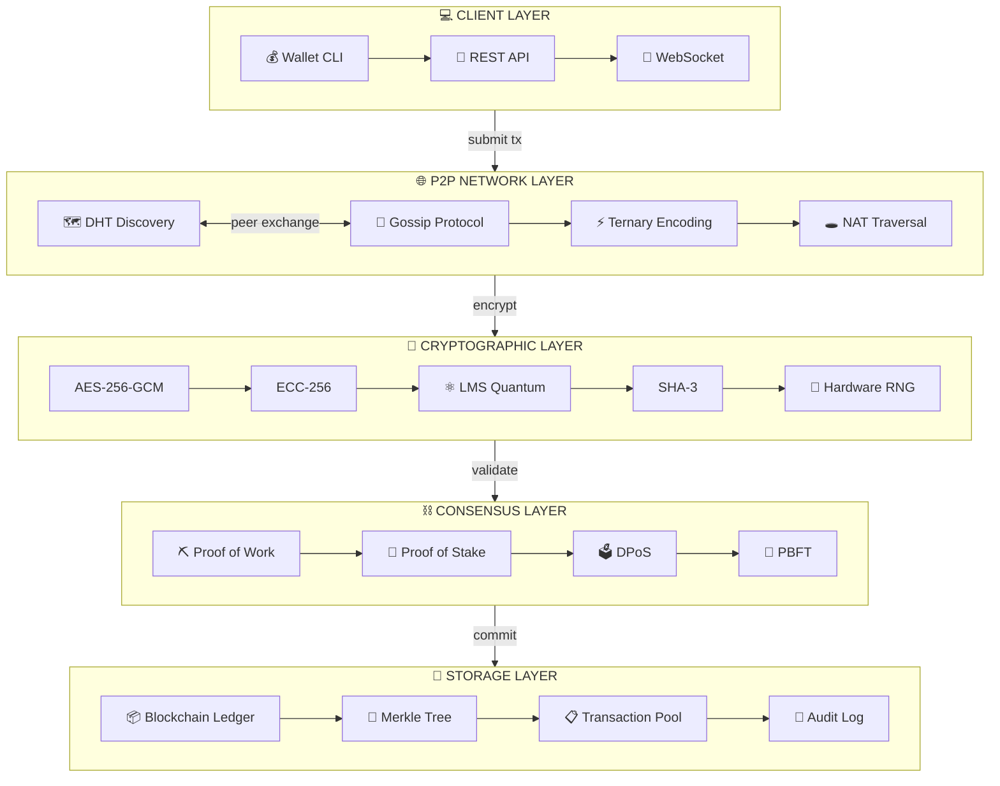

# VOID BANK · P2P BLACK LEDGER

**Version 6.0** | C++17 | AES-256-GCM | LMS Quantum-Resistant | MIT License

---

## PHILOSOPHY

*Trust is a vulnerability. We removed it.*

Void Bank is a production-ready decentralized banking infrastructure built in C++17. It combines military-grade encryption, quantum-resistant cryptography, and blockchain technology to create a tamper-proof financial system with zero trust architecture.

---

## CORE CAPABILITIES

| Capability | Description |
|------------|-------------|
| Real-time Transactions | Sub-second finality with multi-signature support |
| Quantum Resistance | LMS hash-based signatures protecting against quantum attacks |
| P2P Network | Fully decentralized with automatic peer discovery |
| Blockchain Core | Immutable ledger with Merkle tree verification |
| Multi-factor Auth | TOTP, biometric, hardware token, and backup codes |
| Audit Trail | Tamper-proof encrypted logging with integrity verification |

---

## SECURITY LAYERS

- AES-256-GCM — Authenticated Encryption
- SHA-3 Ready — Cryptographic Hashing
- ECC-256 — Elliptic Curve Cryptography
- LMS Quantum Signatures — Post-Quantum Security
- Hardware RNG — True Random Number Generation
- Perfect Forward Secrecy — Session Key Rotation

---

## NETWORK LAYER

- Encrypted P2P Communication — All traffic encrypted with AES-256-GCM
- Ternary Encoding — Custom encoding for efficient data transmission
- NAT Traversal — Automatic NAT hole punching
- Peer Discovery — Distributed peer discovery via DHT
- Connection Pooling — High-performance connection management
- Rate Limiting — Protection against DDoS attacks

---

## BLOCKCHAIN ENGINE

| Component | Specification |
|-----------|---------------|
| Block Time | Dynamic (configurable) |
| Consensus | Multi-algorithm (PoW, PoS, DPoS, PBFT) |
| Merkle Tree | Binary Merkle Tree for transaction verification |
| Smart Contracts | Turing-complete contract execution |
| Transaction Pool | Mempool with fee prioritization |

---

## BANKING OPERATIONS

- Account Creation & Management
- Real-time Balance Tracking
- Transaction History
- Credit Limits & Overdraft Protection
- Multi-signature Transactions
- Escrow Services
- Scheduled Payments
- Foreign Exchange

---

## QUICK START

**Requirements**
- C++17 compatible compiler (GCC 9+, Clang 10+, MSVC 2019+)
- CMake 3.15+
- OpenSSL 1.1.1 or later
- POSIX system (Linux, macOS, WSL2)

**Build from source**

```bash
git clone https://github.com/yourorg/void-bank.git
cd void-bank
mkdir build && cd build
cmake .. -DCMAKE_BUILD_TYPE=Release
make -j$(nproc)
