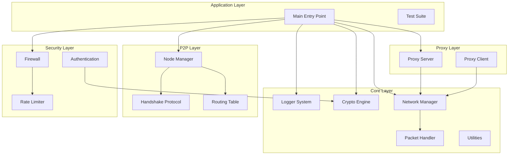

# 🔒 P2P-tester manager

### *Enterprise-Grade Peer-to-Peer Security Framework*

---

## 📋 Table of Contents

- [✨ Features](#-features)
- [🏗️ Architecture](#️-architecture)
- [🚀 Quick Start](#-quick-start)
- [📦 Installation](#-installation)
- [⚙️ Configuration](#️-configuration)
- [🔧 Usage](#-usage)
- [🛡️ Security Features](#️-security-features)
- [📊 API Reference](#-api-reference)
- [🧪 Testing](#-testing)
- [📁 Project Structure](#-project-structure)
- [🤝 Contributing](#-contributing)
- [📄 License](#-license)

---

## ✨ Features

| Category | Features |
|----------|----------|
| 🔐 **Cryptography** | AES-256, SHA-256, CRC32, XOR encryption, Secure random generation |
| 🌐 **Networking** | P2P node management, TCP sockets, Packet serialization, Heartbeat system |
| 🛡️ **Security** | Firewall with rules, Authentication system, Rate limiting, Session management |
| 🔄 **Proxy** | Forward proxy server, Proxy client, Connection pooling, Traffic forwarding |
| 📊 **Monitoring** | Real-time statistics, Connection tracking, Performance metrics, Logging system |

---

## 🏗️ Architecture

