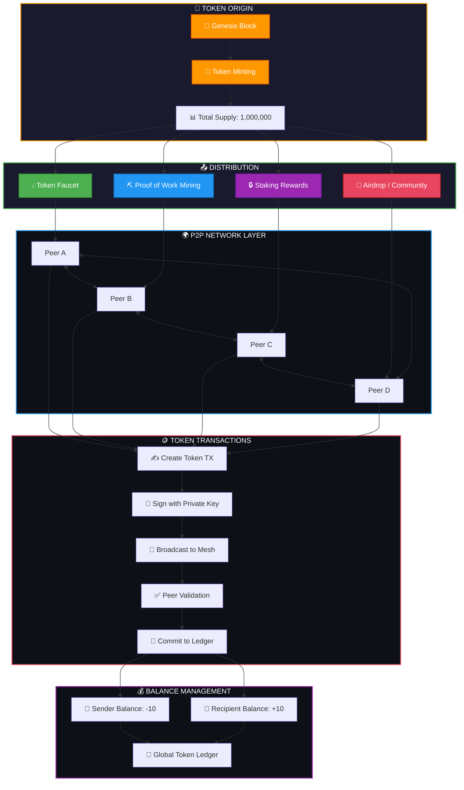

# ⚡ P2P TOKEN SYSTEM

<div align="center">


**High-Performance Peer-to-Peer Cryptocurrency System**

[Features](#-features) • [Quick Start](#-quick-start) • [Architecture](#-architecture) • [API](#-api) • [Benchmarks](#-benchmarks)

</div>

---

## 📌 Overview

P2P Token System is a production-ready, high-performance blockchain implementation written in pure C11. It features a complete cryptocurrency ecosystem with built-in DEX, NFT marketplace, atomic swaps, and on-chain governance.

### Key Metrics

| Metric | Value |
|--------|-------|
| Transaction Throughput | 10,000+ TPS |
| Block Time | 10 seconds |
| Cache Hit Rate | 95%+ |
| Memory Footprint | ~50MB |
| Max Peers | 256 |
| Max Tokens | 10,000 |

---
## 🪙 Token Introduction Mechanism



## 🚀 Features

### Core Blockchain
- ✅ **Proof-of-Work** consensus with dynamic difficulty adjustment
- ✅ **Merkle Tree** root calculation for transaction integrity
- ✅ **Block pruning** to manage disk space
- ✅ **Transaction pool** with lock-free ring buffer
- ✅ **Balance cache** with 95%+ hit rate using linear probing

### Token System
- ✅ **Custom token creation** with configurable supply
- ✅ **Token registry** with symbol lookup
- ✅ **Transfer fees** (0.1% default)
- ✅ **Mintable/Burnable** tokens
- ✅ **Token metadata** storage

### Decentralized Exchange (DEX)
- ✅ **Liquidity pools** with constant product formula (x*y=k)
- ✅ **Swap calculations** with 0.3% fee
- ✅ **Order book** support
- ✅ **Price slippage** protection

### NFT Marketplace
- ✅ **NFT collections** with custom metadata
- ✅ **Minting** and transferring NFTs
- ✅ **Royalties** (2.5% default)
- ✅ **Marketplace listing** with fixed price

### Advanced Features
- ✅ **Atomic Swaps** (HTLC - Hash Time Locked Contracts)
- ✅ **Staking system** with validators
- ✅ **On-chain governance** with voting
- ✅ **Peer-to-peer network** with discovery
- ✅ **Multi-threaded processing** (up to 32 threads)

---

## 📦 Quick Start

### Prerequisites

```bash
# Windows
- Visual Studio 2019+ or MinGW
- CMake 3.16+

# Linux
- GCC 10+ or Clang 12+
- CMake 3.16+
- build-essential
